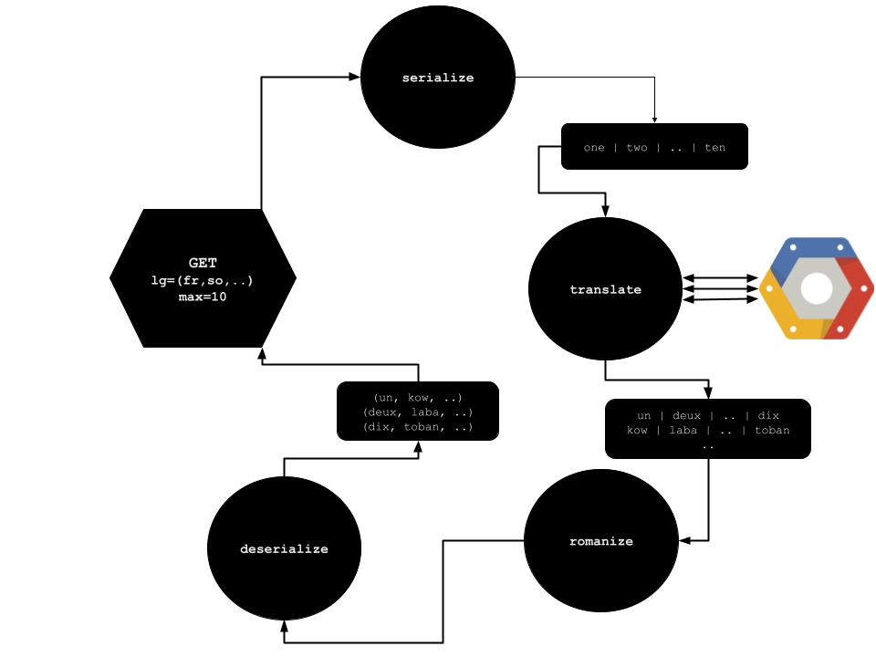

# Open Datasets for Research

**Datasets herein are automatically generated. There are released under the MIT [licence](LICENSE) and liabilities.  
We do not guarantee the accuracy of those datasets. At best, they are as accurate as data sources and data pipelines.** 

## Additional doc

- pipeline(s) documentation [here](pipelines/README.md)

## dataset `numbers`

*content:*

- list all languages numbers from 1 to 99. 

- the dataset in broken into csv tables:

| table             | Languages                     |
|-------------------|-------------------------------|
| bantus.csv        | xh, ny, lg, ln, zu            |
| indo-european.csv | en, ru, uk, be, bg, .. ka, az |

*language codes [here](https://cloud.google.com/translate/docs/languages)*

*data source*: 
- google translate cloud [service](https://cloud.google.com/translate/docs/languages)
  - accurate and available datasource
  - featuring a programmatic interface and client library
- romanization [library](https://github.com/anyascii/anyascii) and [database](https://loc.gov/catdir/cpso/roman)
  - according to [documentation](https://cloud.google.com/translate/docs/advanced/romanize-text), google translate API features a romanization algorithm as well. 
  - But API calls weren't working in the client library, and calls pricing wasn't clear 
  - Moreover it wasn't convenient to double call (translation then romanization). 
  - Threfore, we prefered this open source [library](https://github.com/anyascii/anyascii), which works pretty well and suits our needs.

*data pipeline*: documentation [here](pipelines/README.md)

## `Contribution`

This is an open source project but not very open yet, as the scope of this project is not well-defined. The project is for the moment a backyard to dump research data.
Maybe the project is short-lived. It will be a waste of time to onboard new people given the uncertainty here.

In any case, you can reach me on [LinkedIn](https://www.linkedin.com/in/marcelndeffo/).

Cheers.

