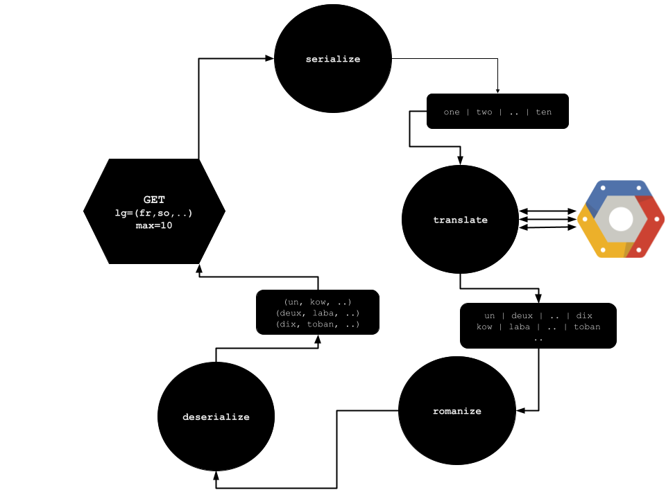

# Pipeline(s) documentation

### Pipeline Translate

- **scope**

  - this pipeline generates integers table in more than 50 languages `-o csv`
    - it can output in json `-o json`
    - or in human-readable text `-o text`
  - language tables are stored column-wise
    - can pass in script entry as many language as needed `-l uk be bg mk`
  - english language is always present in the output table
    - do not pass `-l en`
    - otherwise google-translate will throw an error that will be raised 
  - it can translate from 1 up to 99 
    - the maximum cap can be set to lesser or greater number `-m 111`
  - it can translate up to 999 and even more
    - but it is not well tested 
    - and not recommended as the pipeline is not designed for it:
      - some part can scale (deserialization)
      - some part might not (serialization)


- **requirements**

  - python 3.8+
  - google cloud [cli](https://cloud.google.com/sdk/docs/install)
  - google cloud project for [billing](https://console.cloud.google.com/)
    - translate api activated
    - access role to translate API (translate editor or user)
    - access key to translate API


- **setup** 

````bash
# install requirements
pip install -r requirements.txt
# checkout
python -m unittest pipelines/translate/test.py
# login to translate API
gcloud auth application-default login
# set billing project
export GOOGLE_PROJECT=project-id
gcloud config set project $GOOGLE_PROJECT
export GOOGLE_APPLICATION_CREDENTIALS=/path/to/credential-key.json
````

- run

````bash
# bantu
python pipelines/translate/run.py translate -l xh ny lg ln zu -o csv > numbers/bantus.csv
# indo-european
python pipelines/translate/run.py translate -l ru uk be bg mk bs hr sr sk pl lv lt sl cs ro sq \
it el la co es ca fr de no sv fi hu hy ka az -o csv > numbers/indo-european.csv
````

- architecture
  - each script calls run through 4 stages
  - each stage serve a datastructure transformation and API calls
    - either towards a internal library
    - or towards a cloud service

| stage       | purpose                               | input                                 | output |
|-------------|---------------------------------------|---------------------------------------|--------|
| serialize   | create integers string in english     | integers maximum                      | string |
| translate   | API calls to Google Translate service | serialized string and target language | string |
| romanize    | convert to ascii characters           | serialized string                     | string |
| deserialize | create integers table                 | serialized string                     | table  |



